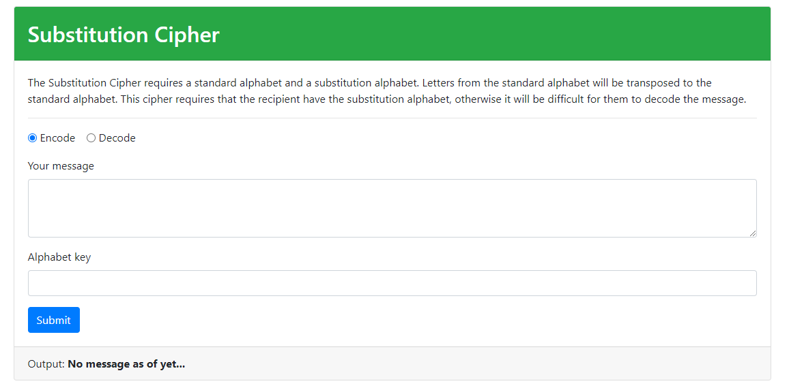

# Decoder-Ring

The decoder ring application allows users to select between three different types of encoding styles and decode or encode a specific message based on given paraters.

##Links

*[Live Demo]()

## Installation

1. Run `npm install` to install project dependencies.
1. Run `npm run start` to start project

The deafult URL locations will be http://localhost:3000.

## Screenshots

### Ceasar Shift

### Polybius Square

### Substitution Cipher

## Technology

### Built with:
* HTML, Javascript, and bootsctrap
